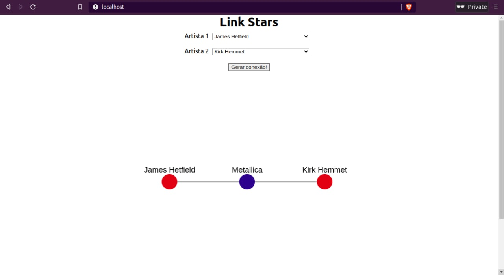

# LinkStars

**Número da Lista**: X<br>
**Conteúdo da Disciplina**: Grafos 1<br>

## Alunos
|Matrícula | Aluno |
| -- | -- |
| 18/0015834  |  Eliseu Kadesh Rosa Assunção Júnior |
| 18/0037242  |  Rodrigo Tiago Costa Lima |

## Sobre 

A ideia do projeto é mostrar a ligação *(link)* entre artistas, com base nas bandas que participaram. E para fazer isso utilizamos o algoritmo **Breadth First Search (BFS)** para gerar todas as ligações de um artista ao outro.

Ao escolher os dois artistas que deseja fazer a ligação, a aplicação mostrará um grafo com o caminho de um artista ao outro, sendo que os nós em vermelho serão os artistas e os azuis as bandas.

## Screenshots



**Ligação entre James Hetfield e Kirk Hemmett**


**Ligação entre Kirk Hemmett e Marty Friedman**


**Ligação não encontrada**

## Instalação 

**Linguagem**: Javascript<br>
**Framework**: React.Js<br>

## Pré-requisitos:

#### Utilizando o docker

- docker >= 20.10.17
- docker-compose >= 1.29.2

#### Sem utilizar o docker

- node >= 16.13
- npm >= 8.13.0

#### Opcional

- make >= 4.2.1

## Instalação:

Clonar o repositório do projeto com o comando:
```
git clone https://github.com/projeto-de-algoritmos/Grafos1_LinkStars.git
```

É possível rodar o projeto utilizando o docker ou utilizando o npm diretamente

Primeiro entre na pasta do projeto:
```
cd Grafos1_LinkStars/link_stars
```
Instale as dependências do projeto:
```
npm install
```
Por fim, para iniciar o projeto:
```
npm start
```
Acesse no navegador:

```
http://localhost:3000/
```

Utilizando o Docker você deve realizar os seguintes comandos:

Primeiro entre na pasta do projeto:

```
cd Grafos1_LinkStars/link_stars
```

Realize o build da imagem e suba o container:

```
docker-compose up
```

Acesse no navegador:

```
http://localhost/
```

Também é possível utilizar o Docker utilizando o Makefile caso tenha o Make instalado realizando o seguinte comando:

```
make run
```

Para remover os containers utilizando o Make, basta usar o seguinte comando:

```
make clean
```

## Uso 

Primeiro acesse a aplicação (Acesse no navegador: http://localhost:3000 sem docker e http://localhost com docker), abrindo a aplicação pode-se escolher 2 artistas diferentes e, caso exista alguma ligação entre eles com base nos dados da aplicação, o grafo que demonstra tal ligação, aparecerá na tela, caso não exista, um alerta informará ao usuário.

## Apresentação

A apresentação está na raiz do repositorio [Apresentação_Grafos1.mp4](./Apresentacao_Grafos1.mp4)


